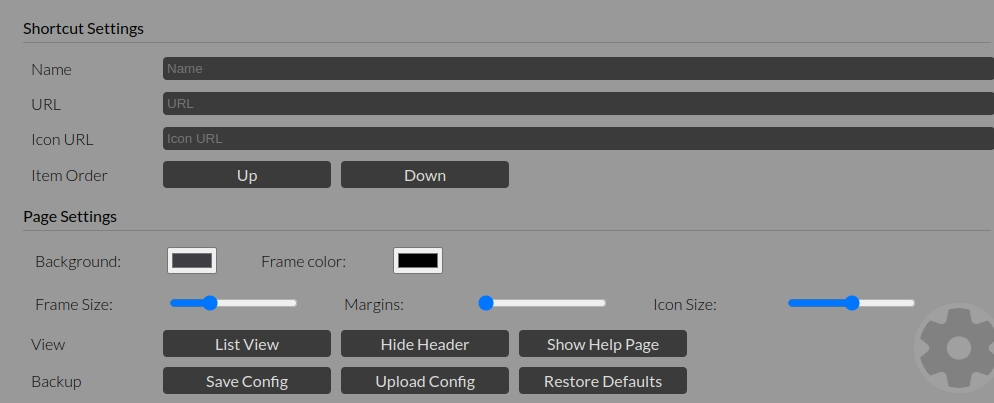
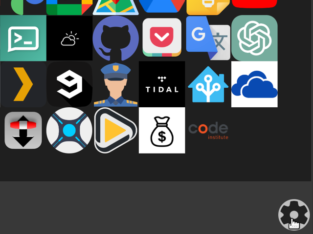

# Simple

a minimalist but beautiful and efficient startpage or homepage for design-conscious users.

[Try it out here](https://pxp888.github.io/startpage/)

## Table of Contents

- [__what is it? - User Experience__](#what-is-it---user-experience)
- [__How does it work?__](#how-does-it-work)
- [__Features__](#features)
    - [Customizable display name and Icon for each link](#customizable-display-name-and-icon-for-each-link)
    - [Drag and Drop icon images](#drag-and-drop-icon-images)
    - [Customizable Icon sizes and surrounding frame](#customizable-icon-sizes-and-surrounding-frame)
    - [Customizable background colors](#customizable-background-colors)
    - [Configurations can be saved to file, and replicated](#configurations-can-be-saved-to-file-and-replicated)
    - [Hideable Header](#hideable-header)
    - [Help page](#help-page)
    - [List View](#list-view)
    - [Settings Panel](#settings-panel)
- [__feature details__](#feature-details)
    - [animated display name over icons](#animated-display-name-over-icons)
    - [animated Header and setting button opacity](#animated-header-and-setting-button-opacity)
    - [animated Settings Panel](#animated-settings-panel)
    - [Mouseover Hints for shortcut input fields](#mouseover-hints-for-shortcut-input-fields)
- [__How to customize icons__](#how-to-customize-icons)
    - [The Easy way - drag and drop](#the-easy-way---drag-and-drop)
    - [The Hard way - manually inputting the image URL](#the-hard-way---manually-inputting-the-image-url)
- [__Project Structure__](#project-structure)
    - [Data Structure](#data-structure)
    - [File Reference Structure](#file-reference-structure)
- [__Frameworks, Libraries & Programs Used__](#frameworks-libraries--programs-used)
- [__other code sources__](#other-code-sources)
- [__Validation and Testing__](#validation-and-testing)
    - [HTML & CSS](#html--css)
    - [Javascript](#javascript)
- [__Deployment__](#deployment)
    - [Forking the GitHub Repository](#forking-the-github-repository)
    - [Local Clone](#local-clone)

# what is it? - User Experience
It is a simple collection of links with corresponding icons for commonly used websites that is easy to customize for individual needs.

Ideally this would be set as the homepage or new tab page of your browser.

# How does it work?
Each link is represented by three pieces of data.  A name, which is up to the user.  A URL, which is the actual destination of the link, and another URL for the icon the user wants to use.

Users are free to use any image they like.

Users can also customize the background colors of the page.

Configuration data for the page is stored in localStorage, and not the cloud.  If users want to replicate the page on multiple machines they can save the configuration data

# Features

### Customizable display name and Icon for each link

Eech link is represented by three pieces of data.

|Item|Description|
|-|-|
|name|This is the displayed name, which is up to the user.
|URL|This is the actual web address of the target website.
|Icon URL|This is the image address the user wants to use.

There are some default links shown if no data has been saved, but users are free to change these to their needs.

Links can be edited and re-ordered through the settings panel.

The settings panel is toggled by pressing the settings gear icon on the lower right corner of the page.

### Drag and Drop icon images

The image URLs to define icons can be set by the user through the settings panel.  The user can also drag and drop images from other websites onto the page to set the icon.

### Customizable Icon sizes and surrounding frame
The size of onscreen icons can be set by the user through the settings panel.  The margin around each icon can also be customized.

### Customizable background colors

The background and frame around the links can be customized.

### Configurations can be saved to file, and replicated

Configuration data is stored locally on each browser, and can be exported to a file.  This file can then be imported to replicate the configuration on other browsers or computers.

### Hideable Header

For a cleaner look the header can be permanently hidden.  This is a page that will be used frequently, so it is recommended to hide the header once the user is familiar with the controls.

### Help page

There is a link on the header to a help page showing how the controls work, and how to edit the page as desired.

There is also a link in the settings panel, which is toggled by pressing the settings gear icon on the lower right corner of the page.

### List View

In addition to the standard grid view, there is also a list view.  This is toggled by pressing the list view button on the settings panel.

The list view is also customizable, and link widths and heights can be set by the user.

Narrow link width allows multiple columns to be shown when the browser window is wide enough.

### Settings Panel

All adjustments and settings are done through the settings panel.

The settings panel is toggled by pressing the settings gear icon on the lower right corner of the page.

# feature details

### animated display name over icons

By default the user only sees the images for each link.  As the user moves their mouse cursor over each link the display name is shown.

### animated Header and setting button opacity
The header and setting button are shown with lower opacity to reduce the clutter and distraction of these items.  They are shown with full opacity as the user moves the mouse cursor over them.

### animated Settings Panel

The settings panel rises and drops from the bottom of the page when the settings button is pressed.

### Mouseover Hints for shortcut input fields

When the user holds the mouse cursor over the input fields for the shortcut names, URLs and icon URLs, a hint is shown to the user.

 

# How to customize icons

## The Easy way - drag and drop
1)  Click on the settings button at the lower right corner of the page.

2) Click on the icon you would like to edit, or on the plus icon to create a new shortcut.

3) Drag an image from another website onto the startpage.

This should automatically update the icon URL field, and the icon should change to the new image.

7) **That's it!** Your shortcut icon is set up.  Click the setting button again to close the settings panel.

## The Hard way - manually inputting the image URL
1)  Click on the settings button at the lower right corner of the page.

2) Click on the icon you would like to edit, or on the plus icon to create a new shortcut.

3) In the **"Name"** field enter the display name you would like for the shortcut.

4) In the **"URL"** field enter the address of the target website.

5) You can use any online image for the icon, but the easiest is to simply use an image search.  For this example we'll use a google image search.  Right click on the image you would like to use and select **"Copy Image Address"** (if using chrome).

6) Paste this link into the **"Icon URL"** field.

7) **That's it!** Your shortcut is set up.  Click the setting button again to close the settings panel.

# Project Structure

The project essentially consists of two HTML pages.  One is for the main page, and the other is for the help page.

The HTML is relatively simple for the main page as most of the functionality comes from Javascript.

## Data Structure

There are two types of data handled for the project.  The first is the actual shortcut data for each link.  The second is customization data for how the page is displayed.  These are both stored in localStorage, but can be exported to a file and/or imported to replicate the page on other machines.

|Item|Description|
|-|-|
|Names|list of names for each link|
|URLs|list of URLs for each link|
|Icon URLs|list of icon URLs for each link|
|View Mode|whether the page is in icon or list view|
|Background Color|background color of the page|
|Header Visibility|whether the header is visible or not|
|Frame Color|color of the frame around the links|
|Frame Size|size of the frame around the links|
|Icon Size|size of the icons|
|List Item Width|width of the list items|
|List Item Height|height of the list items|
|Item Margins|margin around each link|

## File Reference Structure

The __index.html__ file is the main document, along with __help.html__ for the help page.

The __index.js__ file handles the main functionality of the page.  It handles the management of data for both localStorage and file import/export, and the display of the icons.

The __list-view.js__ file adds a list-view option, which alters the CSS applied to icons.

The __dynamic-header.js__ file changes the color of header text based on the background color to ensure readability.

The __mouse-hint.js__ file adds mouseover hints to the input fields in the settings panel.

The __drag-drop.js__ file adds drag and drop functionality to the icon image input fields.

The __index.css__ file handles most of the page styling, except for the icons themselves.  The CSS for the icon view is defined in the __index.js__ and __list-view.js__ files.

The __help-style.css__ file handles the styling for the help page.

The __mouse-hint.css__ file handles the styling for the mouseover hints.

The __drag-drop.css__ file handles the styling for the drop-zone for drag and drop functionality.

_Note - arrows indicate links or scripts, dashed lines are explanations of what the linked files do_

 

# Frameworks, Libraries & Programs Used

|Name|Description|
|-|-|
|VS Code|Code editor|
|Github|Code repository|
|github cli|Command line interface for github|
|Google Chrome|Browser|
|Google Chrome Developer Tools|Browser tool for testing and debugging|
|Google Fonts|Font library|

# other code sources

Code for export and import of localStorage data to file, and vice versa was taken from a Stack Overflow comment.

Some of the CSS used on the help page page was taken from stackedit.io, because I liked the clean look of the body text.

# Validation and Testing
No errors were found in the for Javascript with JSHint.

No errors were found in the for CSS with Jigsaw.

No errors were found in the for HTML with W3C Markup Validation Service.

__Validators Used:__
*   [JS Hint](https://jshint.com/)
*   [Jigsaw](https://jigsaw.w3.org/css-validator/)
*   [W3C Markup Validation Service](https://validator.w3.org/)

In personal testing I have been unable to find bugs that break functionality.  This site has become part of my daily workflow.

__HTML & CSS__

The layout of the icon view of the main page is relatively simple, and changes in screen size are handled by a flex container.  This is straight.

The settings panel is slightly more complex, because there are multiple controls that are grouped according to their function.  Keeping this organized and correctly responsive required both flex containers and a media query adjustment in the CSS.

__Javascript__

This required a lot more experimentation, particularly to make sure that icon data was kept consistently synchronized between the view of the document itself and localStorage.

This required lots of trial and error, and a lot of console.log() statements to make sure that the data was being handled correctly.

The same was true between localStorage and the file import/export functionality, but this is a much simpler process because there is no attention paid to individual pieces of data.  The entire localStorage object is simply exported to a file, and the entire file is imported to localStorage.

The other area that required lots of experimentation was the manipulation of CSS values from javascript.  While working on this project I learned quite a bit about where to place styling and the correct way to manipulate it from javascript.  

Because of this learning mid-process I found that the features I added after were more "correctly" implemented than the features I added earlier.  Particularly with keeping styling more separate from the javascript.

_Given that, I would like to go back and re-write some of the earlier code to be cleaner than it was the first time._

# Deployment
The page is deployed on Github Pages, from the main branch.

Github Pages is a good choice for this project because it is free, and the code is already hosted on Github.  Also, all the code is static, so there Github Pages functionality is sufficient.

The page can be accessed at https://pxp888.github.io/startpage/

### Forking the GitHub Repository
By forking the repository, we make a copy of the original repository on our GitHub account to view and change without affecting the original repository by using these steps:

1.  Log in to GitHub and locate GitHub Repository [startpage](https://github.com/pxp888/startpage)
2.  At the top of the Repository(under the main navigation) locate "Fork" button.
3.  Now you should have a copy of the original repository in your GitHub account.

### Local Clone

1.  Log in to GitHub and locate GitHub Repository [startpage](https://github.com/pxp888/startpage)
2.  Under the repository name click "Clone or download"
3.  Click on the code button, select clone with HTTPS, SSH or GitHub CLI and copy the link shown.
4.  Open Git Bash
5.  Change the current working directory to the location where you want the cloned directory to be made.
6.  Type git clone and then paste The URL copied in the step 3.
7.  Press Enter and your local clone will be created.

