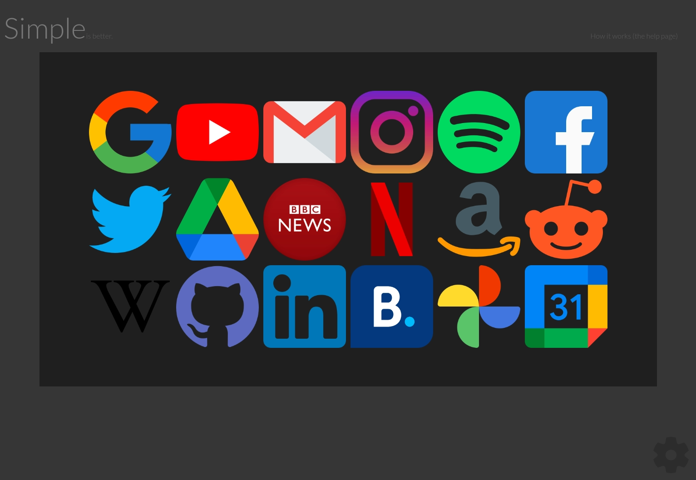
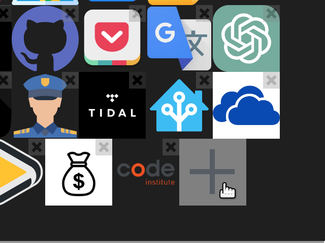

# Simple

a minimalist but beautiful and efficient startpage or homepage for design-conscious users.

[Try it out here](https://pxp888.github.io/startpage/)

## what is it? - User Experience
It is a simple collection of links with corresponding icons for commonly used websites that is easy to customize for individual needs.

Ideally this would be set as the homepage or new tab page of your browser. 

## how does it work?  
Each link is represented by three pieces of data.  A name, which is up to the user.  A URL, which is the actual destination of the link, and another URL for the icon the user wants to use.  

Users are free to use any image they like.  

Users can also customize the background colors of the page.  

Configuration data for the page is stored in localStorage, and not the cloud.  If users want to replicate the page on multiple machines they can save the configuration data 

## features

### Customizable display name and Icon for each link

Eech link is represented by three pieces of data. 

|Item|Description|
|-|-|
|name|This is the displayed name, which is up to the user. 
|URL|This is the actual web address of the target website. 
|Icon URL|This is the image address the user wants to use.  

There are some default links shown if no data has been saved, but users are free to change these to their needs.

Links can be edited and re-ordered through the settings pane.  

The settings panelis toggled by pressing the settings gear icon on the lower right corner of the page.  

## How to customize icons
1)  Click on the settings button at the lower right corner of the page.

2) Click on the icon you would like to edit, or on the plus icon to create a new shortcut. 

3) In the **"Name"** field enter the display name you would like for the shortcut.  

4) In the **"URL"** field enter the address of the target website.  

5) You can use any online image for the icon, but the easiest is to simply use an image search.  For this example we'll use a google image search.  Right click on the image you would like to use and select **"Copy Image Address"** (if using chrome).  

6) Paste this link into the **"Icon URL"** field.  

7) **That's it!** Your shortcut is set up.  Click the setting button again to close the settings pane.  

### Customizable Icon sizes and surrounding frame
The size of onscreen icons can be set by the user through the settings pane.

### Customizable background colors

The background and frame around the links can be customized.  

### Configurations can be saved to file, and replicated 

Configuration data is stored locally on each browser, and can be exported to a file.  This file can then be imported to replicate the configuration on other browsers or computers. 

### Hideable Header

For a cleaner look the header can be permanently hidden.  This is a page that will be used frequently, so it is recommended to hide the header once the user is familiar with the controls.

### Help page

There is a link on the header to a help page showing how the controls work, and how to edit the page as desired.  

There is also a link in the settings pane, which is toggled by pressing the settings gear icon on the lower right corner of the page.

### List View

In addition to the standard grid view, there is also a list view.  This is toggled by pressing the list view button on the settings pane.  

The list view is also customizable, and link widths and heights can be set by the user.  

Narrow link width allows multiple columns to be shown when the browser window is wide enough.

### Settings Pane

All adjustments and settings are done through the settings pane. 

The settings panelis toggled by pressing the settings gear icon on the lower right corner of the page.

## feature details

### animated display name over icons

By default the user only sees the images for each link.  As the user moves their mouse cursor over each link the display name is shown.  

### animated Header and setting button opacity
The header and setting button are shown with lower opacity to reduce the clutter and distraction of these items.  They are shown with full opacity as the user moves the mouse cursor over them.  

## Frameworks, Libraries & Programs Used

|Name|Description|
|-|-|
|VS Code|Code editor|
|Github|Code repository|
|github cli|Command line interface for github|
|Google Chrome|Browser|
|Google Chrome Developer Tools|Browser tool for testing and debugging|
|Google Fonts|Font library|

## other code sources

#### Code for export and import of localStorage data to file, and vice versa was taken from a Stack Overflow comment.  

#### Some of the CSS used on the help page page was taken from stackedit.io, because I liked the clean look of the body text.  

## Validation and Testing
No errors were found in the for Javascript with JSHint.
No errors were found in the for CSS with Jigsaw.
No errors were found in the for HTML with W3C Markup Validation Service.

## Deployment
The page is deployed on github pages, from the main branch.  

